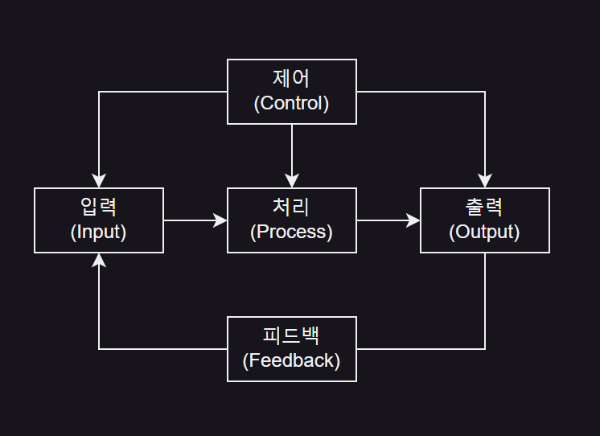
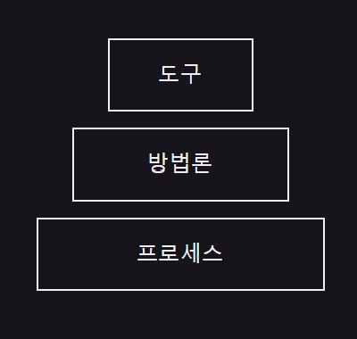

# [01] 소프트웨어 공학의 개념
## 01. 소프트웨어
### 소프트웨어(Software)의 개념
- 컴퓨터를 동작시키고 어떤 일의 처리 순서와 방법을 지시하는 명령어의 집합인 프로그램과 프로그램의 수행에 필요한 절차, 규칙, 관련 문서 등을 총칭

- **프로그램(Program)**

  - 컴퓨터를 통해 일련의 작업을 처리하기 위한 명령어와 관련된 데이터의 집합
 
- **자료 구조(Data Structure)**

  - 컴퓨터 기억 장치 내에 자료의 표현, 처리, 저장 방법 등을 총칭
 
  - 데이터 간의 논리적 관계나 처리 알고리즘을 의미
 
- **문서(Paper)**

  - 소프트웨어를 개발함에 있어서 사용자 설명서, 소프트웨어 요구분석서, 평가서, 명세서, 프로젝트 계획서, 검사 계획서 등을 의미

 

### 소프트웨어의 특징
- **상품성**

  - 소프트웨어를 개발하면 상품이 되어 판매가 됨
 
- **복잡성**

  - 개발하는 과정이 복잡하고 관리가 어려움
 
- **변경 가능성**

  - 프로그램을 일부 수정하여 업그레이드 및 오류 수정 등 가능
 
- **복제성**

  - 복제가 용이해 쉽게 복사, 유통이 가능
 
 

### 시스템(System)의 개요와 기본 요소
- **시스템의 개요**

  - 컴퓨터로 처리 가능한 자료를 입력하고 저장, 처리, 가공해 출력할 수 있도록 설계/구현된 정보 체계
 
  - 하나의 목적을 위해 다양한 요소가 유기적으로 결합된 것
 
- **기본 요소**

  - 입력, 처리, 출력, 제어, 피드백으로 구성
 
|기본 요소|
|-|
||

 

### 소프트웨어 위기(Software Crisis)
- 컴퓨터의 발달 과정에서 소프트웨어의 개발 속도가 하드웨어의 개발 속도를 따라가지 못해 사용자들의 요구사항을 감당할 수 없는 문제가 발생

- **소프트웨어 위기의 원인**

  - 하드웨어 비용을 초과하는 개발 비용의 증가
 
  - 개발 기간의 지연
 
  - 개발 인력 부족 및 인건비 상승
 
  - 성능 및 신뢰성 부족
 
  - 유지보수의 어려움에 따른 엄청난 비용

 

---

 

## 02. 소프트웨어 공학(Software Engineering)
### 소프트웨어 공항(Software Engineering)의 이해
- 경제적으로 신뢰도 높은 소프트웨어를 만들기 위한 방법, 도구와 절차들의 체계

- IEEE(전기전자학회(미국))는 소프트웨어의 개발, 운용, 유지보수 및 파기에 대한 체계적인 접근 방법이라 정의

  - Institute of Electrical and Electronics Engineers
 
 

### 소프트웨어 공학의 기본 원칙
- 현대적인 프로그래밍 기술 적용

- 높은 신뢰성

- 사용의 편리성과 유지보수성

- 지속적인 검증 시행

- 결과에 대한 명확한 기록 유지

- 사용자가 원하는 대로 동작

- 시스템의 안전성과 보안에 신경

- 최신 프로그램 언어, 최신 알고리즘 사용 현황 확인

- 소프트웨어 개발 비용 최소화 노력

- 개발 단계와 소스 코드 등의 문서화를 통해 명확성 유지

 

### 공학적으로 좋은 소프트웨어의 조건
- 신뢰성, 효율적, 사용자의 의도대로 동작

- 편리성 제공 및 잠재적 에러 최소화

- 유지보수성 용이

 

### 소프트웨어 공학 계층 구조

|소프트웨어 공학 계층 구조|
|-|
||

- **도구**

  - 프로세스와 방법을 처리하는 기능을 제공하는 것
 
- **방법론**

  - 소프트웨어를 설계하는데 기술적인 방법을 제공하는 것
 
- **프로세스**

  - 소프트웨어의 가장 기초가 되며 개발에 사용되는 방법론과 도구가 적용되는 순서를 의미
 
 

### 소프트웨어 품질
- 사용자의 요구대로 만들어져야 함

- 유지보수가 쉬워야 함

- 에러 최소화

- 초반에 정한 비용에 맞춰 개발

- 정확한 결과 도출

- 원하는 시간에 원하는 기능 수행 가능

 

### 소프트웨어 공학의 목표
- 소프트웨어의 생산성과 품질 향상

- 최소의 비용으로 단기간에 시스템에 적합한 소프트웨어를 개발하는 것
