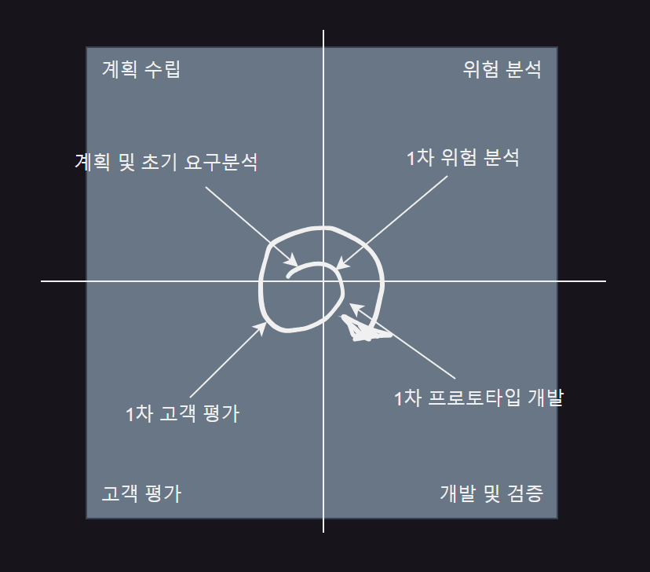
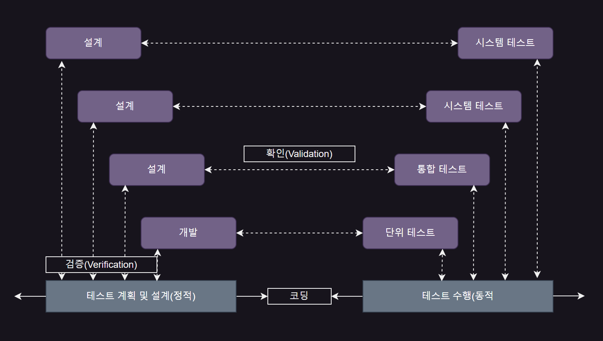
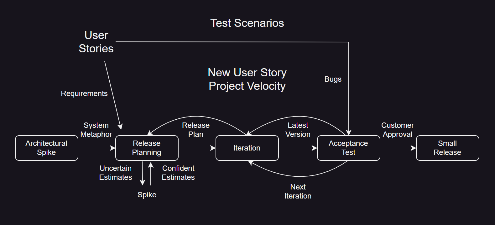

# [03] 소프트웨어 개발 방법론
## 01. 소프트웨어 설계 방법론

### 소프트웨어 생명주기(Software Life Cycle)
- 소프트웨어 제품의 개념 형성에서 시작하여 운용/유지보수에 이르기까지 변화의 모든 과정

- 타당성 검토 → 개발 계획 → 요구사항 분석 → 설계 → 구현 → 테스트 → 운용 → 유지보수

 

### 폭포수 모형(Waterfall Model)의 개요
- 선형 순차적 모델이라고도 함

- Boehm이 제시한 고전적 생명주기 모형

- 소프트웨어 개발 과정의 각 단계가 순차적으로 진행되는 모형

 

### 나선형 모델(Spiral Model)
- Boehm이 제시, 반복적인 작업을 수행하는 점증적 생명주기 모형

- 점증적 모형, 집중적 모형이라고도 하며 유지보수 과정이 필요없음

- 소프트웨어 개발 중 발생할 수 있는 위험을 관리하고 최소화하는 것이 목적

- 나선을 따라서 돌아가면서 각 개발 순서를 반복하여 수행하는 점진적 방식으로 누락된 요구사항 추가 가능

 

|나선형 모델|
|-|
||

 

### 나선형 모형의 개발 단계
- **계획 수립**

  - 기능, 제약 등의 세부적 계획 단계
 
- **위험 분석**

  - 위험 요소 분석 및 해결 방안 설정 단계
 
- **개발과 검증**

  - 기능 개발 및 검증 단계
 
- **고객 평가 및 다음 단계 수립**

  - 결과물 평가 및 추후 단계 진행 여부를 결정하는 단계

 

### 하향식과 상향식 설계
- **하향식 설계**

  - 소프트웨어 설계 시 제일 상위에 있는 Main User Function에서 시작하여 기능을 하위 기능들로 나눠 가면서 설계하는 방식
 
- **상향식 설계**

  - 가장 기본적인 컴포넌트를 먼저 설계한 다음 이것을 사용하는 상위 수준의 컴포넌트를 설계하는 방식

 

### 프로토타입 모형(Prototype Model)의 개요
- 실제 개발될 시스템의 견본(Prototype)을 미리 만들어 최종 결과물을 예측하는 모델

- 개발이 완료되고 나서 사용을 하면 문제점을 알 수 있는 폭포수 모형의 단점을 보완하기 위한 모형

  - 요구사항을 충실 반영 가능

 

### HIPO(Hierarchy Input Process Output)
- 입력, 처리, 출력으로 구성되는 시스템 분석 및 설계와 시스템 문서화용 기법

- 일반적으로 가시적 도표(Visual Table of Contents), 총체적 다이어그램(Overview Diagram), 세부적 다이어그램(Detail Diagram)으로 구성

- 구조도(가시적 도표, Visual Table of Contents), 개요, 도표(Index Diagram), 상세 도표(Detail Diagram)로 구성

- 가시적 도표는 전체적인 기능과 흐름을 보여주는 구조

- 기능과 자료의 의존 관계를 동시에 표현할 수 있음

- 보기 쉽고 이해하기 쉬우며 유지보수가 쉬움

- 하향식 소프트웨어 개발을 위한 문서화 도구

 

### V-모델
- 폭포수 모형에 시스템 검증과 테스트 작업을 강조한 모델

- 세부적인 프로세스로 구성되어 있어서 신뢰도 높은 시스템 개발에 효과적

- 개발 단계의 작업을 확인하기 위해 테스트 작업을 수행

- 생명주기 초반부터 테스트 작업 지원

- 코드뿐만 아니라 요구사항과 설계 결과도 테스트할 수 있어야 함

- 폭포수 모형보다 반복과 재처리 과정이 명확

- 테스트 작업을 단계별로 구분하므로 책임이 명확해짐

 

|V-모델과 테스트 단계|
|-|
||

 

---

 

## 02. 애자일(Agile) 개발 방법론
### 애자일(Agile) 개발 방법론
> 사전적 의미 : 날렵한, 재빠른

- 특정 방법론이 아닌 소프트웨어를 빠르고 낭비 없이 제작하기 위해 고객과의 협업에 초점을 둔 것

  - 소프트웨어 개발 중 설계 변경에 신속히 대응하여 요구사항 수용 가능

- 절차와 도구보다 개인과 소통을 중요시하고 고객과의 피드백을 중요하게 생각함

- 소프트웨어가 잘 실행되는데 가치를 두며, 소프트웨어 배포 시차 최소화 가능

 

<table>
  <tr>
    <th>특징</th>
    <td>짧은 릴리즈와 반복, 점증적 설계, 사용자 참여, 문서 최소화, 비공식적인 커뮤니케이션 변화</td>
  </tr>
  <tr>
    <th>종류</th>
    <td>익스트림프로그래밍(XP, eXtreme Programming), 스크럼(SCRUM), 린(Lean),  DSDM(Dynamic System Development Method, 동적 시스템 개발 방법론),  FDD(Feature Driven Development, 기능 중심 개발), Crystal,  ASD(Adaptive Software Development, 적응형 소프트웨어 개발 방법론),  DAD(Disciplined Agile Delivery, 학습 애자일 배포)</td>
  </tr>
</table>

 

### Agile 선언문

> anstj wndtladl dksls, tlfgod rksmdgks thvmxmdnpdjfmf wndtl

- 프로세스나 도구보다 개인과의 소통이 더 중요

- 완벽한 문서보다 실행되는 소프트웨어가 더 중요

- 계약 협상보다 고객과의 협업이 더 중요

- 계회을 따르는 것보다 변경에 대한 응답이 더 중요

 

---

 

## 03. XP(eXtreme Programming)
### XP(eXtreme Programming)
> 소규모 개발 조직이 불확실하고 변경이 많은 요구를 접하였을 때 적절한 방법

- 1999년 Kent Beck이 제안

  - 개발 단계 중 요구사항이 시시각각 변동이 심한 경우 적합한 방법론
 
- 요구에 맞는 양질의 소프트웨어를 신속하게 제공하는 것을 목표로 함

- 요구사항을 모두 정의해 놓고 작업을 진행하는 것이 아니라, 요구사항이 변경되는 것을 적용하는 방식

  - 예측성보다는 적응성에 더 높은 가치를 부여한 방법
 
- 고객의 참여와 개발 과정의 반복을 극대화하여 생산성을 향상하는 방법

 

### XP 핵심 가치
- **소통(Communication)**

  - 개발자, 관리자, 고객 간의 원활한 소통을 지향
 
- **단순성(Simplicity)**

  - 부가적 기능 또는 미사용 구조와 알고리즘은 배제
 
- **피드백(Feedback)**

  - 소프트웨어 개발에서 변화는 불가피
 
    - 이러한 변화는 지속적 테스트와 통합, 반복적 결함 수정 등 빠르게 피드백
   
- **용기(Courage)**

  - 고객 요구사항 변화에 능동적으로 대응
 
- **존중(Respect)**

  - 개발 팀원 간의 상호 존중을 기본으로 함
 
 

### XP Process

|XP Process|
|-|
||

 

<table>
  <tr>
    <th>용어</th>
    <th>설명</th>
  </tr>
  <tr>
    <td align="center">User Story</td>
    <td>일종의 요구사항으로 UML의 유즈케이스와 같은 목적으로 생성 형식이 없고 고객에 의해 작성된다는 것이 다름 - Spike: 어려운 요구사항, 잠재적 솔루션을 고려하기 위해 작성하는 간단한 프로그램 - User Stories: 사용자의 요구사항을 간단한 시나리오로 표현(UML에서의 Use Case와 목적이 같음)</td>
  </tr>
  <tr>
    <td align="center">Release Planning</td>
    <td>몇 개의 스토리가 적용되어 부분적으로 기능이 완료된 제품을 제공하는 것 부분/전체 개발 완료 시점에 대한 일정 수립</td>
  </tr>
  <tr>
    <td align="center">Iteration</td>
    <td>- 하나의 릴리즈를 세분화한 단위이며 1~3주 단위로 진행 - 반복(Iteration) 진행 중 새로운 스토리가 추가될 때 진행 중 반복(Iteration)이나 다음 반복에 추가</td>
  </tr>
  <tr>
    <td align="center">Acceptance Test</td>
    <td>- 릴리즈 단위의 개발이 구현되었을 때 진행하는 테스트 &nbsp;&nbsp;&nbsp;사용자 스토리에 작성된 요구사항을 확인하여 고객이 직접 테스트 - 오류가 발견되면 다음 반복(Iteration)에 추가 &nbsp;&nbsp;&nbsp;테스트 후 고객의 요구사항이 변경/추가되면 중요도에 따라 우선순위 변경 - 완료 후 다음 반복(Iteration) 진행</td>
  </tr>
  <tr>
    <td align="center">Small Release</td>
    <td>- 릴리즈 단위를 기능별로 세분화하면 고객의 반응을 기능별로 확인 가능 - 최종 완제품일 때 고객에 의한 최종 테스트 진행 후 고객에 제공</td>
  </tr>
</table>

 

### XP의 12가지 실천사항(Practice)

<table>
  <tr>
    <th>구분</th>
    <th>12 실천사항</th>
    <th>설명</th>
  </tr>
  <tr>
    <td rowspan=4 align="center">Fine Scale Feedback</td>
    <td align="center">Pair Programming (짝 프로그래밍)</td>
    <td>- 두 사람이 짝이 되어 한 사람은 코딩, 다른 사람은 검사 수행 - 코드에 대한 책임 공유, 비형식적인 검토 수행 가능 - 코드 개선을 위한 리팩토링 장려, 생산성이 떨어지지 않음</td>
  </tr>
  <tr>
    <td align="center">Planning Game</td>
    <td>게임처럼 선수와 규칙, 목표를 두고 기획에 임함</td>
  </tr>
  <tr>
    <td align="center">Test Driven Development</td>
    <td>실제 코드를 작성하기 전에 단위테스트부터 작성 및 수행 이를 기반으로 코드 작성</td>
  </tr>
  <tr>
    <td align="center">Whole Team</td>
    <td>개발 효율을 위해 고객을 프로젝트 팀원으로 상주시킴</td>
  </tr>
  <tr>
    <td rowspan=3 align="center">Continuous Process</td>
    <td align="center">Continuous Integration</td>
    <td>상시 빌드 및 배포를 할 수 있는 상태로 유지</td>
  </tr>
  <tr>
    <td align="center">Design Improvement</td>
    <td>기능 변경 없이 중복성/복잡성 제거, 커뮤니케이션 향상, 단순화, 유연성 등을 위한 재구성 수행</td>
  </tr>
  <tr>
    <td align="center">Small Releases</td>
    <td>짧은 주기로 잦은 릴리즈 함으로써 고객이 변경사항을 볼 수 있게 함</td>
  </tr>
  <tr>
    <td rowspan=4 align="center">Shared Understanding</td>
    <td align="center">Coding Standards</td>
    <td>소스 코드 작성 포맷과 규칙들을 표준화된 관례에 따라 작성</td>
  </tr>
  <tr>
    <td align="center">Collective Code Ownership</td>
    <td>시스템에 있는 소스 코드는 팀의 모든 프로그래머가 누구든지 언제라도 수정 가능</td>
  </tr>
  <tr>
    <td align="center">Simple Design</td>
    <td>가능한 가장 간결한 디자인 상태 유지</td>
  </tr>
  <tr>
    <td align="center">System Metaphor</td>
    <td>최종적으로 개발되어야 할 시스템의 구조 기술</td>
  </tr>
  <tr>
    <td align="center">Programmer Welfare</td>
    <td align="center">Sustainable Pace</td>
    <td>일주일에 40시간 이상 작업 금지, 2주 연속 오버타임 금지</td>
  </tr>
</table>

 

### 효과적인 프로젝트 관리를 위한 3대 요소
- 사람(People) - 인적 자원

- 문제(Problem) - 문제 인식

- 프로세스(Process) - 작업 계획

 

### 정형 기술 검토 지침 사항
- 의제와 그 범위 유지

- 참가자의 수 제한

- 각 체크 리스트를 작성하고, 자원과 시간 일정을 할당

- 개발자가 아닌 제품의 검토에 집중

- 논쟁과 반박 제한

- 검토 과정과 결과 재검토

