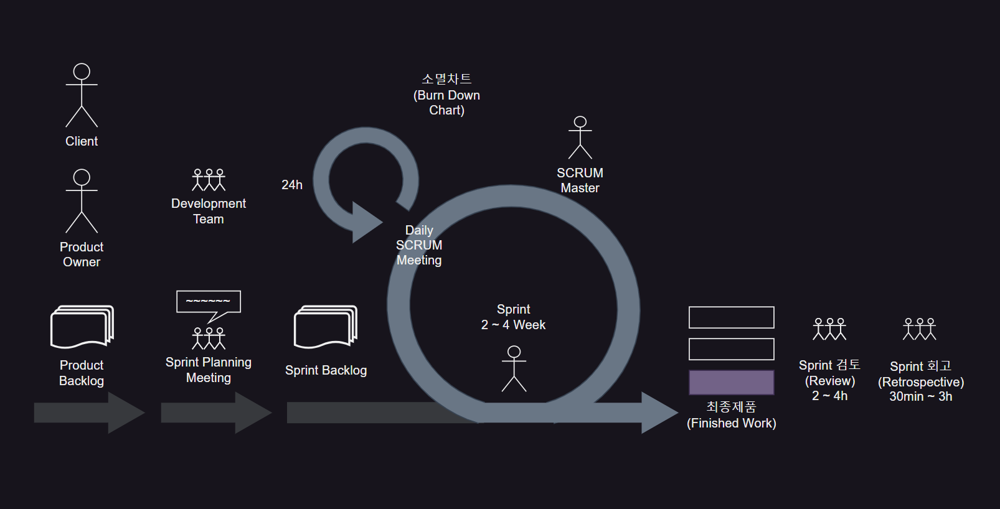

# SCRUM
## 01. SCRUM
### SCRUM 개념과 특징
- 요구사항 변경에 신속하게 대처할 수 있도록 반복적이고 점진적인 소규모 팀원 간 활발한 소통과 협동심이 필요한 팀 중심의 소프트웨어 개발 방법론

- 신속하게 반복적으로 실제 작동하는 소프트웨어를 제공

- 개발자들의 팀 구성과 각 구성원의 역할, 일정 결과물 및 그 외 규칙을 정하는 것

- 기능 개선점에 우선순위 부여, 개발 주기 동안 실제 동작 가능한 결과 제공

- 커뮤니케이션을 위하여 팀은 개방된 공간에서 개발하고, 매일 15분 정도 회의 진행

- 팀원 스스로 팀을 구성해야 함

  - Self Organizing
 
- 개발 작업에 관한 모든 것을 팀원 스스로 해결해야 함

  - Cross Functional
 
 

### SCRUM 기본 원리
- 기능 협업을 기준으로 배치된 팀은 스프린트 단위로 소프트웨어 개발

- 스프린트는 고정된 30일의 반복이며, 스프린트 시행하는 작업은 고정됨

- 요구사항, 아키텍처, 설계가 프로젝트 전반에 걸쳐 잘 드러나야 함

- 정해진 시간을 철저히 지켜야 하며, 완료된 모든 작업은 제품 백로그에 기록됨

- 가장 기본적인 정보 교환 수단 : 일일 스탠드 업 미팅 or 일일 스크럼

 

### SCRUM 팀

|SCRUM 팀|
|-|
||

 

### SCRUM 팀의 역할

|담당자|역할|
|:-:|-|
|제품 책임자 (Product Owner)|- 개발 목표에 이해도가 높은 개발 의뢰자, 사용자가 담당 - 제품 요구사항을 파악하여 기능 목록(Product Backlog) 작성 - 제품 테스트 수행 및 요구사항 우선순위 갱신 - 업무 관점에서 우선순위와 중요도를 표시하고 신규 항목 추가 - 스프린트 계획 수립까지만 임무 수행 - 스프린트가 시작되면 팀 운영에 관여하지 않음|
|스크럼 마스터|- 업무를 배분만 하고 일은 강요하지 않으며 팀을 스스로 조직하고 관리하도록 지원 - 개발 과정 장애 요소를 찾아 제거 - 개발 과정에서 스크럼의 원칙과 가치를 지키도록 지원|
|스크럼 팀|- 제품 책임자, 스크럼 마스터를 제외한 팀원(개발자, 디자이너, 제품 테스터 등 모든 팀원, 5~9명 내외) - 기능을 작업 단위로 분류, 요구사항을 사용자 스토리로 도출 및 구현 - 일정, 속도를 추정한 뒤 제품 책임자에게 전달 - 스프린트 결과물을 제품 책임자에게 시연 - 매일 스크럼 회의에 참여하여 진행 상황 점검|

 

---

 

## 02. SCRUM 과정
### Product Backlog
- 제품 개발에 필요한 모든 요구사항(User Story)을 우선순위에 따라 나열한 목록

- 개발 과정에서 새롭게 도출되는 요구사항으로 인해 지속해서 업데이트 됨

- 제품 백로그에 작성된 사용자 스토리를 기반으로 전체 일정 계획인 릴리즈 계획 수립

 

### Sprint
- 작은 단위의 개발 업무을 단기간에 전력 질주하여 개발한다는 의미

  - 반복 주기(2~4주)마다 이해관계자에게 일의 진척도 보고
 
 

### Sprint Planning Meeting
- Product Backlog(제품 기능 목록)에서 진행할 항목 선택

- 선택한 Sprint에 대한 단기 일정 수립

  - 요구사항을 개발자들이 나눠 작업할 수 있도록 Task 단위로 나눔

- 개발자별로 Sprint Backlog를 작성하고 결과물에 대한 반복 완료시 모습 결정

- 수행에 필요한 요구사항을 SCRUM Master에게 보고하여 이해관계자로부터 지원 받음

 

### Daily SCRUM Meeting
- 매일 약속된 시간에 짧은 시간 동안(약 15분) 서서 진행 상황만 점검

- 한 사람씩 어제 한 일과 오늘 할 일을 이야기하고 스프린트 작업 목록을 잘 개발하고 있는지 확인

  - 완료된 세부 작업 항목을 완료 상태로 옮겨 스프린트 현황판에 갱신
 
- 스크럼 마스터는 방해 요소를 찾아 해결

  - 잔여 작업 시간을 소멸 차트(Burn down Chart)에 기록
 
 

### Finished Work
- 모든 스프린트 주기가 완료되면 제품 기능 목록(Product Backlog)의 개발 목표물 완성

 

### 스프린트 리뷰(Sprint Review)
- 스프린트 검토 회의(Sprint Review)에 개발자와 사용자가 같이 참석

- 하나의 스프린트 반복 주기(2~4주)가 끝나면 실행 가능한 제품이 생성됨

  - 이에 대해 검토하며, 검토는 가능한 4시간 안에 마무리
 
- 개선해야 할 사항에 대하여 제품 책임자(Product Owner)는 피드백 정리, 제품 백로그(Product Backlog) 작성

  - 다음 스프린트에 적용
 
 

### 스프린트 회고(Sprint Retrospective)
- 스프린트에서 수행한 활동과 결과물 살펴봄

- 개선점이 있는지 살펴보고 문제점을 기록하는 정도로 진행

- 팀의 단점을 찾기보다는 강점을 찾아 팀 능력 극대화

- 개발 추정 속도와 실제 작업 속도를 비교하고차이가 있다면 이유 분석

